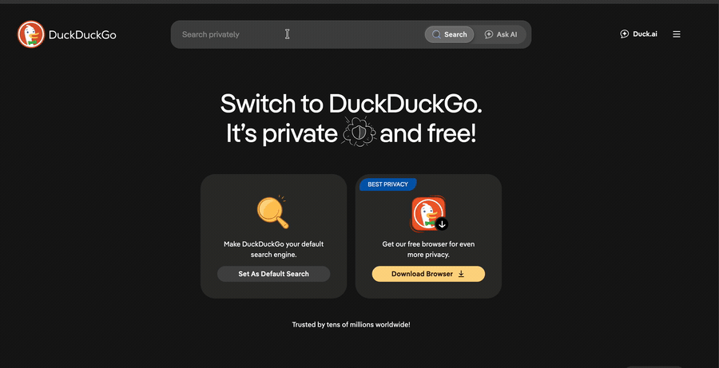
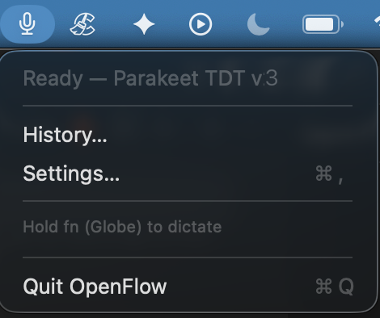
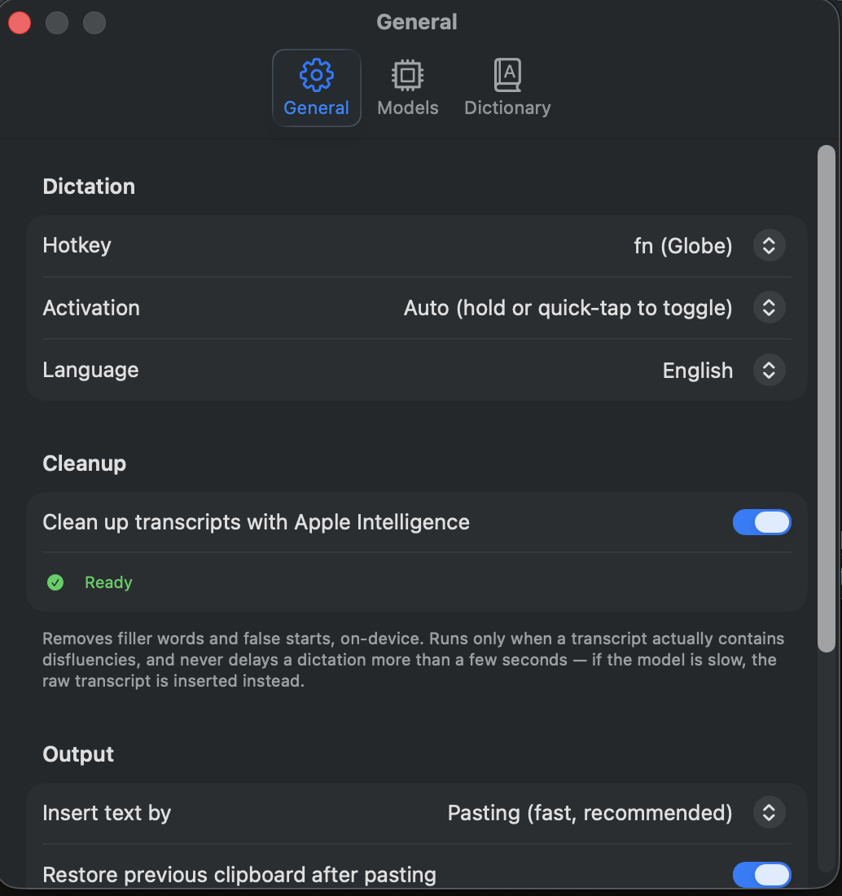
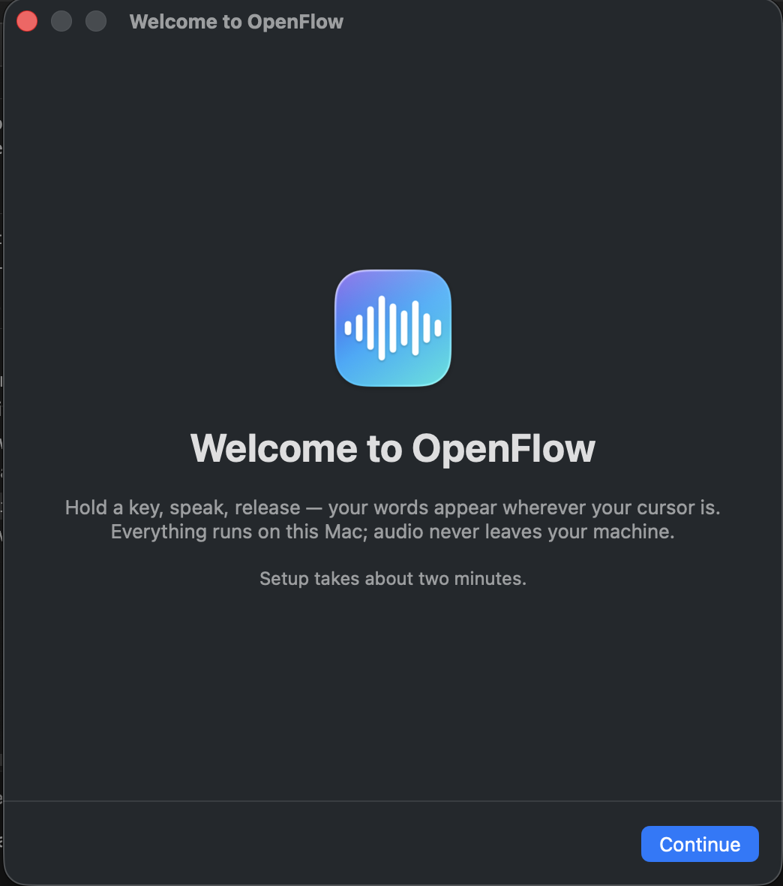
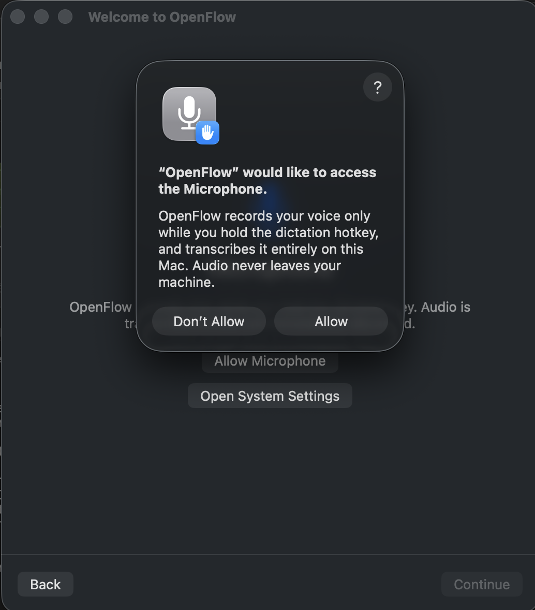
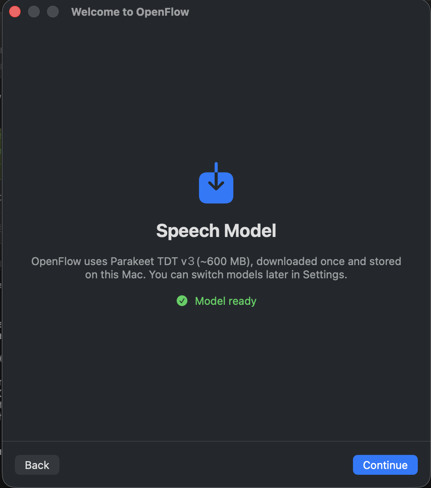
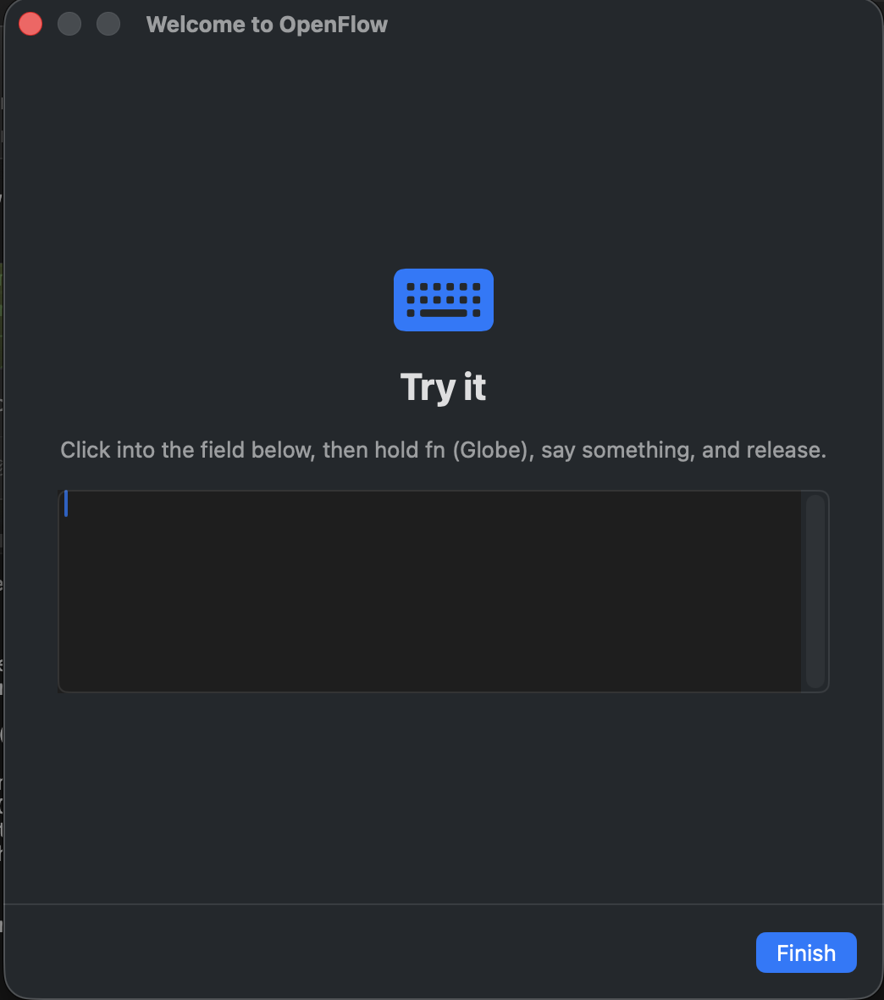
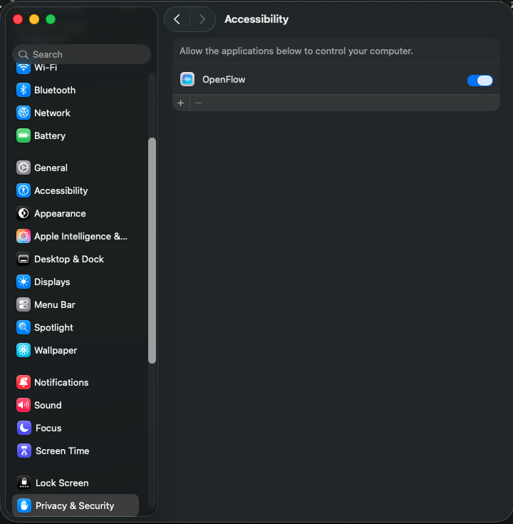

# OpenFlow

Open-source, local-only voice dictation for macOS. Hold a key, speak, release — your words appear wherever your cursor is. An alternative to Wispr Flow with no subscription, no cloud, and no audio ever leaving your Mac.

<p align="center">
  <a href="https://robj1925.github.io/open-flow/"><b>Website</b></a>
  &nbsp;&middot;&nbsp;
  <a href="https://github.com/Robj1925/open-flow/releases/latest/download/OpenFlow.zip"><b>Download for Mac</b></a>
  &nbsp;&middot;&nbsp;
  <a href="https://github.com/Robj1925/open-flow/releases/latest"><b>Releases</b></a>
</p>

<p align="center">
  
</p>

<p align="center"><sub>Hold the key, speak, release. The transcript lands right where your cursor is.</sub></p>

## Features

- **System-wide dictation**: works in any app — editors, browsers, chat, terminals
- **Hold or toggle**: hold `fn` (default) and release to insert, or quick-tap to toggle hands-free; `Esc` cancels
- **Two local engines**, switchable in Settings:
  - **Parakeet TDT v3** (default): the fastest engine, best English accuracy, and it also covers 24 European languages. Via [FluidAudio](https://github.com/FluidInference/FluidAudio).
  - **Whisper Large v3 Turbo**: the broad multilingual fallback, roughly 100 languages including Chinese, Japanese, Korean, Arabic, and Hindi. Via [WhisperKit](https://github.com/argmaxinc/argmax-oss-swift).
  - **Other languages**: Parakeet handles English and 24 European languages automatically. For anything outside that set (Chinese, Japanese, Korean, Arabic, Hindi, and the rest), switch to Whisper Large v3 Turbo in the Models tab, then set your language in Settings. OpenFlow dictates one selected language at a time (no auto-detect yet).
- **Custom dictionary & snippets**: teach it "cube cuddle" → `kubectl`, or expand spoken triggers into whole blocks
- **Hallucination filtering**: silence never injects "Thank you." into your editor
- **Local history**: searchable transcript log in SQLite, on your disk only
- **Clipboard-safe**: pastes via a transient clipboard entry (ignored by clipboard managers) and restores what you had copied

## Screenshots

<p align="center">
  
</p>

<p align="center"><sub>Lives in your menu bar. It shows the active engine and whether it is ready, with History and Settings a click away.</sub></p>

<p align="center">
  
</p>

<p align="center"><sub>Settings: choose your hotkey and activation style, pick a language, toggle on-device cleanup, and set how text is inserted.</sub></p>

## Requirements

- Apple Silicon Mac, macOS 14+ (macOS 26+ for the Apple Intelligence cleanup pass)
- ~600 MB disk per model (downloaded on first run, cached locally)
- No Xcode required to build — Command Line Tools are enough

## Install (download)

Grab `OpenFlow.zip` from the [latest release](../../releases/latest), unzip, and drag `OpenFlow.app` to Applications.

**First launch:** this build isn't notarized by Apple yet, so macOS will block a normal double-click. Right-click `OpenFlow.app` → **Open** → **Open**. If macOS still refuses, approve it under System Settings → Privacy & Security → "Open Anyway", or clear the quarantine flag:

```sh
xattr -dr com.apple.quarantine /Applications/OpenFlow.app
```

Onboarding then walks you through Microphone + Accessibility permissions and the model download. Hold `fn`, speak, release.

<table>
  <tr>
    <td width="25%" valign="top"></td>
    <td width="25%" valign="top"></td>
    <td width="25%" valign="top"></td>
    <td width="25%" valign="top"></td>
  </tr>
</table>

<p align="center"><sub>The first-run flow takes about two minutes: welcome, microphone access (audio stays on your Mac), the one-time model download, then a field to try it live.</sub></p>

## Build & run

```sh
make run        # builds release, assembles dist/OpenFlow.app, opens it
make build      # debug build
make test       # runs the Swift Testing suite (swift run openflow-tests)
make cli        # builds the openflow-cli spike tool
```

On first launch, onboarding walks through the required permissions:

| Permission | Why |
|---|---|
| Microphone | capture your voice while the hotkey is held |
| Accessibility | watch for the global hotkey and paste text into the focused app |
| Input Monitoring | only if macOS refuses the event tap with Accessibility alone |

> **Ad-hoc signing note:** without a Developer ID, macOS ties permission grants to the binary's signature — after rebuilding you may need to re-grant Accessibility (toggle OpenFlow off/on in System Settings). Set `CODESIGN_ID="Developer ID Application: …"` when running `make app` if you have a signing identity.

<p align="center">
  
</p>

<p align="center"><sub>System Settings, Privacy &amp; Security, Accessibility. This grant lets OpenFlow watch for the hotkey and paste into the focused app.</sub></p>

If you use `fn` as the hotkey, set System Settings → Keyboard → *Press 🌐 key to* → **Do Nothing** so the emoji picker stays out of the way.

## CLI

`openflow-cli` exercises the transcription stack without the app:

```sh
openflow-cli models                  # list model presets and download state
openflow-cli record 8                # record 8s from the mic, transcribe with Parakeet
openflow-cli compare 8               # record once, run BOTH engines head-to-head
openflow-cli file speech.wav both    # transcribe an audio file with both engines
```

## Architecture

```
hotkey (CGEventTap) ─► AudioCaptureEngine (16 kHz mono)
                            │
                            ▼
                   TranscriptionEngine  ◄─ protocol seam
                   ├─ FluidAudioEngine (Parakeet TDT v3, CoreML)
                   └─ WhisperKitEngine (Whisper, CoreML)
                            │
                            ▼
                   TranscriptPipeline
                   ├─ HallucinationFilter (energy gate + no-speech prob + artifact list)
                   ├─ LLMCleanerStage     (Apple Intelligence, on-device; runs only when
                   │                       the transcript contains disfluencies)
                   └─ DictionaryReplacer  (word-boundary custom vocabulary)
                            │
                            ▼
                   TextInjector (clipboard snapshot → ⌘V → restore, or keystroke typing)
```

Core logic lives in the `OpenFlowCore` library (UI-free, tested); the menu-bar app shell is `Sources/OpenFlowApp`.

## License

MIT — see [LICENSE](LICENSE).
